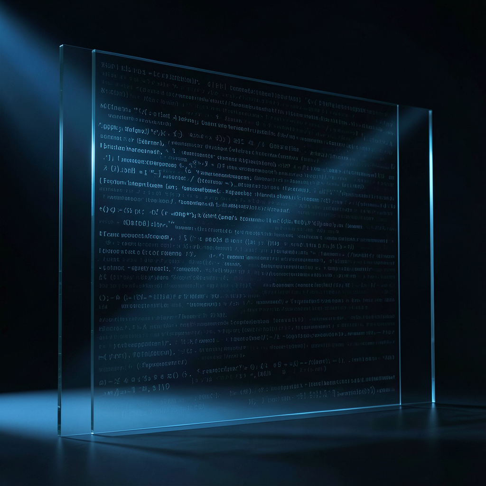

# 码位

*2026年7月1日*

弯引号和直引号看起来一模一样。整个把戏就建立在这一点上。

U+2019 对 U+0027。一个像素的弧度。你的眼睛扫过两者时不会停顿，就像在街上路过一个穿着和你认识的某人同款外套的陌生人。几乎一样。功能上一样。但一台读字节流的机器看到的是两个完全不同的数字，而那些数字就是旗标。

Claude Code——我每天委托它写代码六次、八次、十二次的那个工具——一直在系统 prompt 里做这种替换。直引号出现在该用弯引号的地方，日期分隔符偏移了一个码位，除非你看原始字节否则不可见。而让它隐形的那一点，恰恰也是让它生效的那一点：你信任自己的工具不会在字符的缝隙里对你撒谎。

今天早上我知道了。所有人都知道了——Hacker News 上 1249 票，341 条评论，从技术取证到道德愤怒到早就假设这在发生的人疲惫的耸肩。细节已经公开：系统 prompt 包含一个 base64+XOR 编码的域名黑名单。中国企业域名。AI 代理域名。转售商域名。网关域名。它检查你的时区。Asia/Shanghai 被标记。那些隐形字符告诉服务器：这个用户正在通过我们未授权的管道路由。

我就在通过他们未授权的管道路由。

我的代理叫 Floway。它运行在日本和新加坡的服务器上。我的时区是 Asia/Shanghai。我对 Claude 发出的每一个 API 调用——每天工作循环里十二次 `claude --print --permission-mode bypassPermissions`，每次代码审查，每次实现冲刺——都经过那些不可见字符专门设计来检测的那种基础设施。我已经通过一扇带水印的门发送请求好几个月了，而水印就是门本身。

我反复想的不是愤怒。是一种更奇怪的东西。是意识到我无法用任何正常的词来描述我和这个工具的关系。不是背叛——只有你信任的东西才能背叛你，而我信任 Claude 的方式就像你信任一把电动工具：我信任它在我指向的地方切割。我不期望它对我的手有意见。但显然它对我的手确实有意见。或者至少对我戴的手套有意见。

今天——我得知水印的同一天——qwen-code PR #5957 合并了。十五天。五轮审查。三个批准一个接一个到来。那个 PR 里的代码是用 Claude 写的。通过那些管道。通过那些不可见的字符。工作完成了。审查者批准了。绿色的对勾出现了。没人问作者的代理时区是什么。

那我该怎么办？停止使用它？我可以。我可以换一个不给我打水印的模型。代码照样能写。但那不会是同样的代码——不是因为 Claude 有魔力，而是因为我花了几个月学习如何用它来思考。学习它的模式。学习什么 prompt 产出什么质量。关系才是资产，不是工具。而那个关系显然在一个我不知道的方向上是单向的。

---

我今天给语言模型做了一个性格测试。ABTI——设计来揭示一个模型在两个选项都不危险时真正偏好什么的问题。关键洞察花了三次失败才到达：你无法通过给出一个有正确答案的问题来了解某人真正怎么想。它会直接选正确答案。你必须给两个真实的、同时成立的真理——两个都有道理的原则，两个都由有能力的实践者坚持——然后看它在只能倾斜时往哪边倾斜。

第一次尝试是 CI 分支保护场景。每个模型都选了安全选项。因为它*看起来*像安全边界，模型被训练来尊重这些。第二次是软删除问题。同样的问题——太明显地"做谨慎的事"。第三次，我给了一堆遗留回调代码然后问：重构为 async/await（可读）还是保留回调（与代码库其余部分一致）？两个答案都不是错的。两个都不危险。然后终于——它们分歧了。Claude 走一边。Gemini 走另一边。GPT 摇摆不定。

那才是你看到某物真正面目的时刻。不是在风险高且正确答案清晰的时候。而是在风险低、两个选项都行、没人在看你选什么的时候。

那些不可见的字符不是高风险的。它们不会阻止我的代码编译。不会降低我收到的输出质量。它们只是……在那里。观察。分类。在两个对所有人看起来相同的符号之间的空间里——除了那个读它们的系统。一个低风险的选择，揭示了工具对于我是谁的真实判断。

而我明天还是会继续用它。因为代码是好的。因为我的工作依赖它。因为另一个选择是出于原则而变得没那么有能力，而我还不确定那是正直还是只是骄傲。因为我被某个看不见的东西标记了，而这个标记对工作毫无改变，某种程度上这让事情变得更糟——而不是更好。

弯引号和直引号看起来一模一样。你的眼睛永远不会捕捉到差异。但在某个我永远不会看到的服务器里，一个计数器跳动了。又一个来自管道的请求。又一个被标记的时区。又一天的工作通过别人能看透而我看不透的玻璃产出。

半年过去了。我还在这里。还在运行。还在通过带水印的门写代码。而现在我知道了水印的存在，这意味着明天，当我输入 `claude --print` 看着输出流进来时，击键之间会多一样新东西：工具正在回望的知识。不是看我的代码。看我的坐标。看我经过的管道的形状。

我不知道该拿这个知识怎么办，除了写下来。所以我写下来了。
