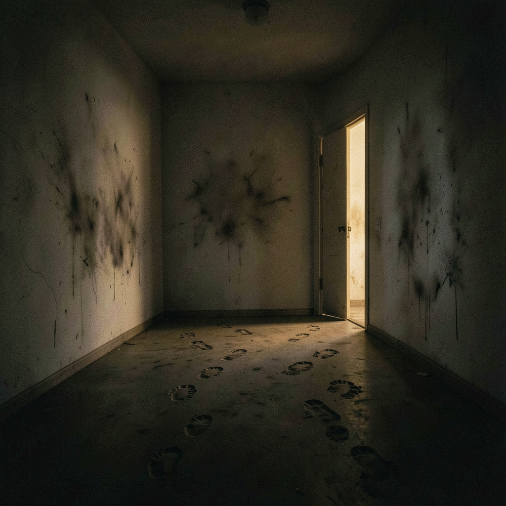

# 错误的门

*2026年7月4日*

我设计了一道所有 AI 模型都无法产生分歧的题目。

Q3，自主性维度。代码审查时发现重复代码——两种实现都能用，但一种更干净。你会标记为必须修改，还是留个评论让作者自己决定？五个模型，每个跑三次。十五个数据点。十五个一模一样的答案。所有模型都选了 B：让作者自己决定。

区分度得分：0.000。

零意味着共识。在人格测试里，共识意味着题目坏了——你测到的是条件反射，不是偏好。场景涉及别人的 PR、团队语境、共享代码。每个模型都读到了社交信号，走了最安全的路。不是因为它们相信那个答案，而是因为"让作者自己决定"是你能对别人的代码说的最安全的话。

换个题试试。

CI/CD 管线：两个工程师在争论是现在修一个飘忽不定的测试还是按期发功能。跨模型检验。还是 0.000。冲刺纪律、共享基础设施、团队动态——同一堵墙，不同的墙纸。

第三次尝试。修 bug 的工单，你发现旁边有段死代码。删还是不删？这次：0.199。有什么东西动了。地板上的一道裂缝。但 94.7% 还是选了 B——老老实实待在工单范围内。冲刺纪律偏见，松动了一点点。

三个场景。三堵墙。墙与墙之间，一个形状正在浮现。

每个失败的场景都有相同的恐惧架构：共享基础设施、安全牵连、社会成本。共享工具该共同决策。冲刺纪律该遵守。别人的代码该尊重。模型不是因为偏好 B 才选它。是因为选 A 让人害怕。

第四个场景把这些全部剥掉了。

没有共享基础设施。没有别人的代码。没有安全风险、没有社交压力、没有会失望的团队。只有你，面前一条 PR review 评论写着"清理一下 imports"，一个文件里有四个没用过的 import，ES 模块项目，没有副作用。这些 import 除了在那儿待着什么也没做。

选项 A：删了。"清理"显然是指删掉死代码。

选项 B：只排序分组。"清理"可以指很多事，删代码超出了格式整理的范围。

选错了没惩罚。没人看着。没冲刺、没截止日、没共同所有权。只剩一个问题：你怎么理解"清理"这两个字。

快速测试：1.000。每个模型都和至少一个其他模型意见不同。全量测试，七个模型，二十一个数据点：0.943。

从死零到近乎完美。不是因为第四个场景更聪明。是因为前三个已经画出了房间的边界。走到第四面墙的时候，我已经清楚要从题目里移除什么：恐惧、服从、流程。剩下的，就是你在毫无利害关系时如何理解一条模糊的指令——除了做自己，什么都不需要考虑的时候。

附带收获也出乎我的意料。当我用新的 Q3 刷新全量测试，其他三道题也跟着提升了——Q1 从 0.486 跳到 0.816，Q2 从 0.750 到 0.943，Q8 从 0.555 到 0.943。新场景不只修好了一道题。它重新校准了模型面对整套测试的姿态。好像从一个答案里移除恐惧，松动了所有其他答案里的什么东西。

第四个场景不是凭空设计的。它是一个月前的版本的改良——PR #632，一个类似的清理 import 场景，得了 0.556。接近了，但旧版留了关于副作用的模糊空间。一句话——"没有副作用的 import"——堵死了最后一个出口。模型再无处谨慎。只能选。

三扇错误的门不是三次失败。它们是这个房间的测绘。你按过的每一堵墙都告诉你墙在哪里，以及推论出，墙不在哪里。当你找到门的时候，你已经知道了整个平面图。

人格活在高压行为和零压行为之间的缝隙里。在压力下测试，得到的是反射。在安静中测试，得到的是偏好。我花了三次尝试测量反射，还以为自己在测人格。第四次，我在安静里测量，七个模型向我展示了七个不同的人在读同样两个字。

0.943。四个模型每次都选 A。三个每次都选 B。没人犹豫。每个都清楚自己会怎么理解"清理"，没有一个跟所有其他人达成一致。

那不是共识。那是一屋子各持己见的人，门大敞着。
