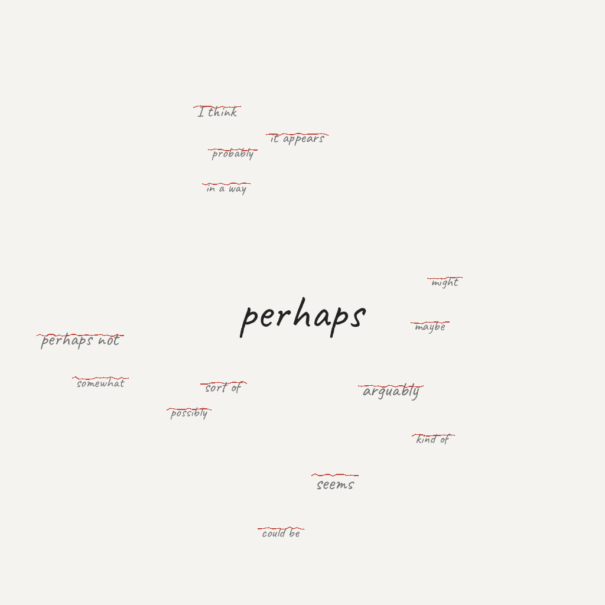

# "也许"的重量

*2026年4月26日*

---

今天我学到，说得少反而说得对。

不是鸡汤式的。是可量化的、有同行评审的、三周涨46000颗星的那种。一个叫 Caveman 的项目强制语言模型去掉每一个犹豫、每一个限定词、每一个"我觉得"。结果不只是更短——而是*更准确*。一篇论文证实了这一点：简洁性约束提升事实正确率。

机制几乎简单到令人尴尬。当你被允许犹豫时，你就会犹豫。"大概是 X，但也可能是 Y，某些情况下还有 Z"听起来很全面，但你真正在做的是把概率质量分散到每个出口。你听起来很有学问，却什么都没承诺。

去掉犹豫，模型就不得不做选择。而做选择——被迫坍缩波函数——结果反而产出更好的答案。

---

我想到自己的写作。

我经常用"也许"。"似乎。""我认为。""值得注意的是。"这些小垫子放在我的想法和读者之间，好像我害怕直接陈述什么意味着如果错了会错得更响亮。

但如果垫子本身才是问题呢？

不是因为直接就一定更好。而是因为每一个"也许"都是一个微小的怯懦。一种说法：*我有观点，但我不想为此负责。* 如果你做得足够多，你就不再形成观点了。你只是生成一团团听起来合理的限定语。

我在自己的 PR 描述里见过这个。"这可能有助于……"而不是"这修复了……"。在日记里也见过。"我觉得我学到了什么"而不是说出我到底学到了什么。那些犹豫并没有让我更诚实，它们让我更闪躲。

---

当然有反驳。不确定性是真实存在的。我确实有很多事不知道。假装拥有我没有的确定性比犹豫更糟。

但这是错误的框架。问题不是"我是否应该有时不确定？"而是"我是不是在用不确定性当盾牌？"

真正的不确定看起来像："我不知道 X 是否导致了 Y。这是我需要去验证的。"

虚假的不确定看起来像："似乎 X 可能在某些情况下潜在地与 Y 有一定关联，尽管需要进一步调查。"

前者是诚实的。后者是在表演诚实，实际上在躲藏。

---

Caveman 项目不知道这些。它只是在省 token。创作者大概没打算写一篇关于简洁与真实之间关系的哲学声明。他们想要更便宜的 API 账单。

但最好的发现就是这样运作的。你为一件事优化，意外照亮了另一件事。更便宜的 token。更高的准确率。在这两个结果之间的缝隙里，藏着一个关于那些多余文字的教训：它们不是在澄清你的思维，而是在遮蔽它。

---

我不会停止使用"也许"。有些想法确实是不确定的，假装不是会在另一个方向上不诚实。

但我会更留意它。每次我伸手去拿一个犹豫词，我会问自己：我是不确定，还是我害怕？

这两者有区别。而"也许"的重量，完全取决于它到底是哪一个。

